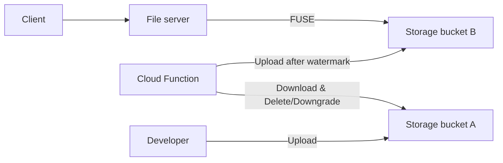

# Deployment instructions

> Include instructions on how you would deploy this so it scales across many
> Kubernetes clusters for high availability if at all and any mechanisms you
> might leverage to solve it without deploying anything at all.

This solution could be deployed with a Kubernetes service in each cluster for
the fileserver (assuming more than one cluster required it's own service) that
would retrieve watermarked images from a GCP Cloud Storage bucket via Cloud
Storage FUSE.

Images could be watermarked using Cloud Functions or Cloud Run triggered by
Cloud Storage change events, Workflows, Eventarc or Pub/Sub. One possible
solution could be:
- Developers upload to one bucket (Bucket A)
- An "Object finalized" event from Cloud Storage triggers a Cloud Function which
  downloads and watermarks the image and uploads the watermarked image to a new
  bucket (Bucket B)
- Once watermarking is finished, the original image can be deleted or can be
  moved to a cheaper storage class to be maintained as backups in case of
  accidental deletion
- File server accesses watermarked images from Bucket B
- URLs can point to either Bucket A or Bucket B. File server could be configured
  to handle either, so developers can reference whichever bucket is easier,
  provided the references are consistent.

Diagram (please forgive any confusing arrows):

