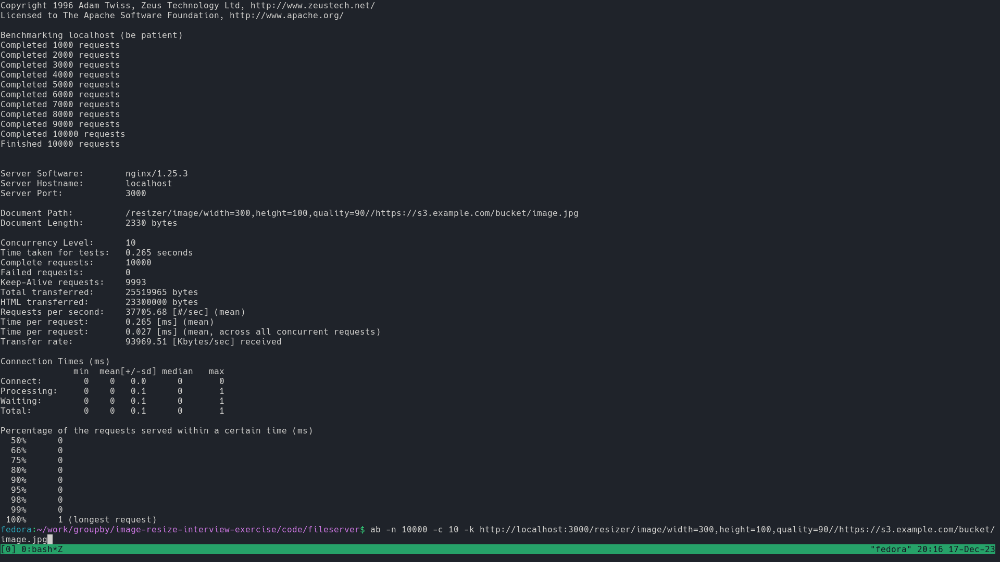
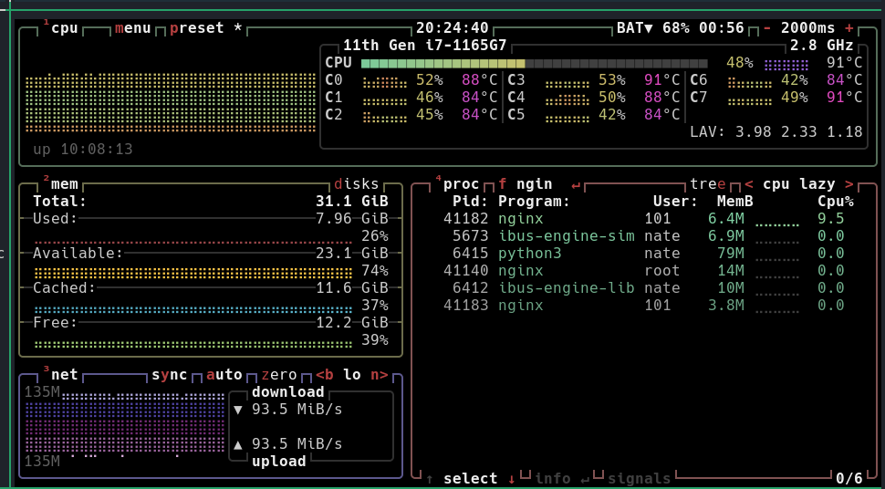

# Solution

> Design, architect and test an end to end solution that works for 10 RPS -
> 100,000 RPS. Show some load tests, or what you expect the load test to look
> like when we run it.

The code contained in the repo could provide an end to end solution capable of
efficiently serving large numbers of requests.

## Approach

Process and serve images as needed with static file server.

Developers upload images to storage bucket as usual. Requests are directed to
static file server, which checks cache for existing version. If not found,
retrieves file from bucket, resizes, caches and returns.

Images would have to be watermarked before reaching the static file server. This
could be done in one of two ways:
1.  Developers watermark prior to upload
2.  Automated service

Obviously, since one of the primary purposes of this exercise is to reduce the
work developers handle themselves, some type of automated service has a clear
advantage.

The fileserver directory contains a configuration for an NGINX instance that
provides the described functionality. Given a url like
`/resizer/image/width=80,quality=75/https://s3.example.com/bucket/image.png`,
the fileserver checks for a local file matching the provided params in the
cache, and if not found, it retrieves the file from disk, resizes it, caches and
returns the resized image. There is also a Dockerfile to containerize the
service.

There is also a script, `watermark_image.sh`, to watermark all images contained
in the `fileserver/images` directory. This should be run before trying to build
the container.

The current setup is meant just to be a proof of concept. For information on how
such a system could be deployed to production, see
[DEPLOYMENT_INSTRUCTIONS](DEPLOYMENT_INSTRUCTIONS.md)

The ability of the service to handle large request volumes will depend not just
on the specific resources allocated, but also on the ratio of cache hits and
misses.

Testing locally, a single docker container could handle approximately 35,000 -
38,000 RPS when repeatedly requesting a cached image. Unfortunately, a higher
cache miss rate was too difficult to test in the time available.

Screenshot of load test result:

Screenshot of CPU utilization during test:

